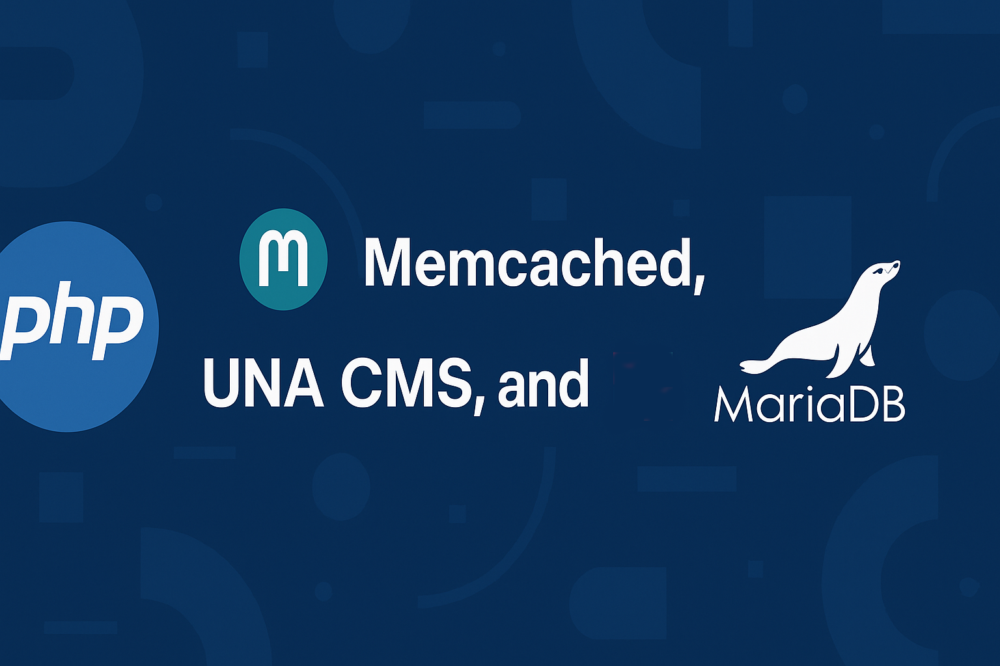

<p align="center">
    <a href="https://www.coozila.com/plus/view-organization-profile/coozila" target="_blank">
        
    </a>
</p>

<p align="center">
    
</p>

<p align="center">
    <a href="https://github.com/kabballa/PHP-UNA/dev/main/LICENSE" target="_blank">
        
    </a>
</p>

> If you enjoy the project, please consider giving us a GitHub star ⭐️. Thank you!

---

## Sponsors

If you want to support our project and help us grow, you can [become a sponsor on GitHub](https://github.com/sponsors/coozila).

<p align="center">
    <a href="https://github.com/sponsors/coozila"></a>
</p>

---

# Introducing Kabballa: PHP-FPM for UNA Applications Deployment

<p align="center">
    
</p>

Kabballa is a cutting-edge application designed to streamline the management and deployment of modern, scalable infrastructures. This platform supports a wide array of technologies, including:

- MySQL
- Redis
- Nginx
- PHP
- Golang
- Vite
- Node.js
- Memcached
- Elasticsearch
- And more!

Leveraging the power of Kubernetes (K8s) or Docker Swarm, Kabballa provides an efficient way to host and orchestrate applications across multiple environments. Soon, Kabballa will become open source, inviting the community to contribute and innovate.

<p align="center">
    
</p>

### **Final Goal**

The ultimate aim is to launch UNA Apps in a global multicloud environment, ensuring redundancy and scalability using Karmada and Kubernetes.

---

## Features

- Install PHP-FPM

---

## ⚠️ Installation Instructions

Follow these steps to install and configure PHP and MariaDB using this script:

1. Clone or download the script to your server:
   ```bash
   git clone https://github.com/kabballa/PHP-UNA.git
   cd PHP-UNA
   ```

2. Make the script executable:
   ```bash
   chmod +x /home/coozila/data/kabballa/kabballa/php-setup.sh
   ```

3. Run the script with root privileges:
   ```bash
   sudo /home/coozila/data/kabballa/kabballa/php-setup.sh
   ```

4. During execution, the script will prompt you to select PHP versions to install. You can:
   - Press Enter to install the default version (8.2).
   - Type `all` to install all supported versions (7.4, 8.0, 8.1, 8.2).
   - Specify one or more versions separated by spaces (e.g., `7.4 8.1`).

5. The script will automatically install and configure:
   - PHP and its required modules.
   - Memcached and Imagick extensions for each PHP version.
   - MariaDB with optimized settings.

6. Verify the installation:
   - Check installed PHP versions:
     ```bash
     php -v
     ```
   - Check installed extensions:
     ```bash
     php -m
     ```
   - Verify MariaDB status:
     ```bash
     sudo systemctl status mariadb
     ```

7. If you encounter any issues, review the script logs for debugging.

---

## Trademarks and Copyright

This software listing is packaged by Coozila!. All trademarks mentioned are the property of their respective owners, and their use does not imply any affiliation or endorsement.

### Copyright

Copyright (C) 2009 - 2025 Coozila! Licensed under the MIT License.

### Licenses

Coozila!: MIT License

---

## Disclaimer

This product is provided "as is," without any guarantees or warranties regarding its functionality, performance, or reliability. By using this product, you acknowledge that you do so at your own risk. Coozila! and its contributors are not liable for any issues, damages, or losses that may arise from the use of this product. We recommend thoroughly testing the product in your own environment before deploying it in a production setting.

---

Happy coding!