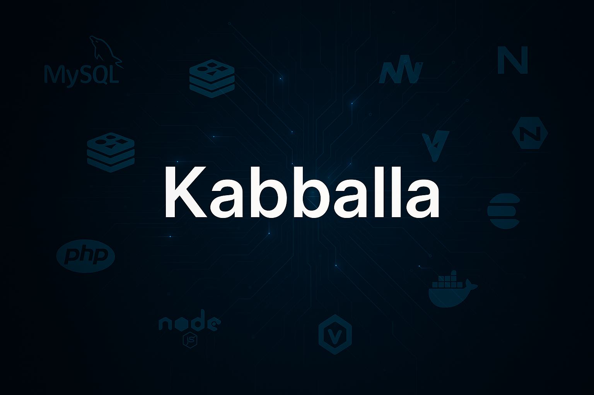

<p align="center">
    <a href="https://www.coozila.com/plus/view-organization-profile/kabballa" target="_blank">
        
    </a>
</p>

<p align="center">
    
</p>

<p align="center">
    <a href="https://github.com/kabballa/PHP-UNA/dev/main/LICENSE" target="_blank">
        
    </a>
</p>

> If you enjoy the project, please consider giving us a GitHub star ⭐️. Thank you!

## 1. Sponsors

If you want to support our project and help us grow, you can [become a sponsor on GitHub](https://github.com/sponsors/coozila).

<p align="center">
    <a href="https://github.com/sponsors/coozila"></a>
</p>

## 2. Introducing Kabballa: PHP-FPM for UNA Applications Deployment

<p align="center">
    
</p>

Kabballa is a cutting-edge application designed to streamline the management and deployment of modern, scalable infrastructures. This platform supports a wide array of technologies, including:

- MySQL
- Redis
- Nginx
- PHP
- Golang
- Vite
- Node.js
- Memcached
- Elasticsearch
- And more!

Leveraging the power of Kubernetes (K8s) or Docker Swarm, Kabballa provides an efficient way to host and orchestrate applications across multiple environments. Soon, Kabballa will become open source, inviting the community to contribute and innovate.

<p align="center">
    
</p>

### **Final Goal**

The ultimate aim is to launch any Apps in a global multicloud environment, ensuring redundancy and scalability using Karmada and Kubernetes.

## 3. Features

- Install PHP-FPM
- Configure PHP settings dynamically using `.env` files.

## 4. PHP Extensions Installed by the Script

This script installs the following PHP extensions for each selected PHP version:

- **Core Extensions**:
  - `php-fpm`
  - `php-cli`
  - `php-dev`

- **Common Extensions**:
  - `php-curl`
  - `php-gd`
  - `php-mbstring`
  - `php-zip`
  - `php-mysql`
  - `php-exif`
  - `php-fileinfo`
  - `php-opcache`
  - `php-readline`
  - `php-xml`
  - `php-soap`
  - `php-intl`
  - `php-bcmath`

- **PECL Extensions**:
  - `memcached` (via PECL)
  - `imagick` (via PECL)

> **Note**: The script installs only the PHP extensions. It does not install the Memcached or DragonflyDB servers. Refer to the "Important Notes on Memcached and DragonflyDB" section for more details.

## 5. Important Notes on Memcached and DragonflyDB

This script **does not install the Memcached server**. It only installs the PHP extensions required to interact with Memcached. If you want to use Memcached, you need to install the Memcached server separately.

Alternatively, you can use **DragonflyDB** as a modern replacement for Memcached. DragonflyDB is a high-performance, scalable in-memory database that supports Memcached and Redis protocols. It can be used as a drop-in replacement for Memcached in your infrastructure.

To install Memcached or DragonflyDB, follow their respective installation guides:

- **Memcached Cluster (Kabballa Compatible)**: [Memcached Cluster Installation Guide](https://github.com/kabballa/memcached-cluster)
- **DragonflyDB Cluster (Kabballa Compatible)**: [DragonflyDB Cluster Installation Guide](https://github.com/kabballa/dragonflydb-cluster)

## 6. PHP Documentation and License

- Official PHP Documentation: [https://www.php.net/docs.php](https://www.php.net/docs.php)
- PHP License: [https://www.php.net/license/](https://www.php.net/license/)

## 7. Contributing

We welcome contributions from the community! To get started, please read our [Contributing Guidelines](CONTRIBUTING.md).

## 8. Trademarks and Copyright

This software listing is packaged by Coozila!. All trademarks mentioned are the property of their respective owners, and their use does not imply any affiliation or endorsement.

### 8.1 Copyright

Copyright (C) 2009 - 2025 Coozila! Licensed under the MIT License.

### 8.2 Licenses

- Coozila!: MIT License
- PHP: [PHP License](https://www.php.net/license/)

## 9. Disclaimer

This product is provided "as is," without any guarantees or warranties regarding its functionality, performance, or reliability. By using this product, you acknowledge that you do so at your own risk. Coozila! and its contributors are not liable for any issues, damages, or losses that may arise from the use of this product. We recommend thoroughly testing the product in your own environment before deploying it in a production setting.

Happy coding!

## 10. Installation Instructions

### 10.1 Quick Network installation with `curl`

You can install UNA PHP with Kabballa lib setup directly, without cloning the repo:

**For the `dev` branch with latest optimization:**
```bash
curl -sSL -o php.sh https://raw.githubusercontent.com/kabballa/PHP-UNA/dev/php.sh
chmod +x php.sh
./php.sh
```

**For the `1.0.0` branch:**
```bash
curl -sSL -o php.sh https://raw.githubusercontent.com/kabballa/PHP-UNA/1.0.0/php.sh
chmod +x php.sh
./php.sh
```

Follow the on-screen prompts to complete the installation.

### 10.2 Local deployment

Follow these steps to install and configure PHP using this script:

- Clone or download the script to your server:
  ```bash
  git clone https://github.com/kabballa/PHP-UNA.git
  cd PHP-UNA
  ```

- Make the script executable:
  ```bash
  chmod +x php-setup.sh
  ```
- The `.env` file is used to override the default values in the `php.sh` script. By default, the script uses predefined values for PHP, Opcache, Memcached, and PHP-FPM settings.

- Copy the example environment file:
  ```bash
  cp .env.example .env
  ```

- Edit`.env` in your preferred text editor and modify the values as needed, for example:
  ```bash
  MEMORY_LIMIT=65536M
  UPLOAD_MAX_FILESIZE=8192M
  POST_MAX_SIZE=8192M
  ```

- Save the file and then run the script with root privileges:
  ```bash
  sudo ./php-setup.sh
  ```

  During execution, the script will prompt you to select PHP versions to install. You can:
  - Press Enter to install the default version (8.2).
  - Type `all` to install all supported versions (7.4, 8.0, 8.1, 8.2).
  - Specify one or more versions separated by spaces (e.g., `7.4 8.1`).

- The script will automatically install and configure:
  - PHP and its required modules.
  - Memcached and Imagick extensions for each PHP version.

- Verify the installation:
  - Check installed PHP versions:
    ```bash
    php -v
    ```
  - Check installed extensions:
    ```bash
    php -m
    ```

- If you want to change the settings, edit the `.env` file, save it, and re-run the script to apply the changes:
  ```bash
  sudo ./php-setup.sh
  ```

- If you encounter any issues, review the script logs for debugging.

## 12. How to Fork and Modify the Repository

1. **Fork the Repository**:
    - Go to the [GitHub repository](https://github.com/kabballa/PHP-UNA).
    - Click the "Fork" button in the top-right corner to create your own copy of the repository.

2. **Clone Your Fork**:
    - Clone the forked repository to your local machine:
      ```bash
      git clone [https://github.com/](https://github.com/)<your-username>/PHP-UNA.git
      cd PHP-UNA
      ```

3. **Configure Git Username and Email**:
    - Before committing changes, ensure your Git username and email are configured:
      ```bash
      git config --global user.name "Your Name"
      git config --global user.email "your-email@example.com"
      ```

    - You can verify the configuration with:
      ```bash
      git config --global --list
      ```

4. **Make Changes**:
    - Modify the files as needed using your preferred text editor or IDE.
    - After making changes, stage and commit them:
      ```bash
      git add .
      git commit -m "Your commit message"
      ```

5. **Push Changes**:
    - Push your changes to your forked repository:
      ```bash
      git push origin main
      ```

6. **Sign Your Commits**:
    - All pull requests must have signed commits to be accepted. To sign your commits, configure GPG signing in Git:
      ```bash
      git config --global user.signingkey <your-gpg-key-id>
      git config --global commit.gpgsign true
      ```

    - If you don't have a GPG key, generate one using:
      ```bash
      gpg --full-generate-key
      ```

    - After generating the key, list your keys to find the key ID:
      ```bash
      gpg --list-secret-keys --keyid-format=long
      ```

    - Add the key to your GitHub account by exporting it:
      ```bash
      gpg --armor --export <your-gpg-key-id>
      ```

    - Copy the output and add it to your GitHub account under **Settings > SSH and GPG keys > New GPG key**.

    - When committing, ensure your commits are signed:
      ```bash
      git commit -S -m "Your commit message"
      ```

7. **Create a Pull Request**:
    - Go to your forked repository on GitHub.
    - Click "Compare & pull request" to propose your changes to the original repository.

## 13. Thank You

Thank you for using Kabballa! We hope it simplifies your PHP-FPM configuration and deployment process. If you have any feedback or suggestions, feel free to contribute or reach out to us.
